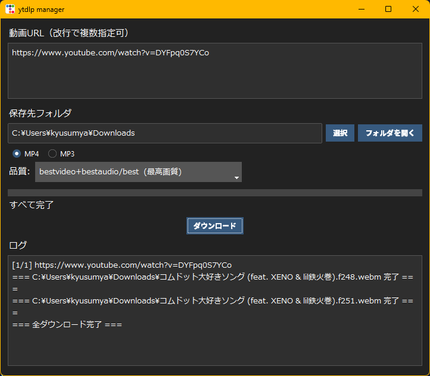

# 🎬 ytdlp manager

**ytdlp manager** は、YouTubeから動画や音声を簡単にダウンロードできる GUI ツールです。  
`yt-dlp` をバックエンドに使用し、**MP4 / MP3** 形式で保存可能！✨

---

## 💻 デモスクリーンショット



---

## 🌟 主な特徴

- シンプルで直感的な GUI（Tkinter + ttkbootstrap）
- 動画と音声のダウンロード対応（MP4 / MP3）
- 複数 URL の同時ダウンロード対応（改行で指定）
- 進捗バーとログ表示で状況確認可能
- ffmpeg を使用した音声変換対応（MP3）
- Windows / macOS / Linux 対応
- ダークテーマ対応（ttkbootstrap: darkly）

---

## 🛠 インストール方法

1. リポジトリをクローンまたは ZIP ダウンロード

```
git clone https://github.com/kyusumya/ytdlp-manager.git
cd ytdlp-manager
```

2. 必要な Python パッケージをインストール

```
pip install -r requirements.txt

macOS (Homebrew Required!):
brew install python-tk
```

> requirements.txt の例:
> ```
> yt-dlp
> ttkbootstrap
> ```

3. （MP3 変換を使用する場合）ffmpeg をインストールして PATH に追加
- Windows: https://ffmpeg.org/download.html or scoop install ffmpeg
- macOS: brew install ffmpeg
- Linux: sudo apt install ffmpeg

---

## 🚀 使い方

1. python main.py でアプリを起動
2. ダウンロードしたい動画の URL をテキストボックスに貼り付け  
   - 複数 URL は改行で区切る
3. 保存先フォルダを選択
4. MP4 または MP3 を選択
5. 動画・音声の品質を選択
6. 「ダウンロード」ボタンをクリック
7. 下部のログと進捗バーで状況を確認

---

## 📂 ファイル構成例

```
ytdlp-manager/
├─ main.py
├─ requirements.txt
├─ README.md
├─ screenshot.png
```

---

## ⚠ 注意事項

- MP3 変換には ffmpeg が必須
- 再生リスト URL は自動で &list= 部分を削除して個別動画として処理
- エラー発生時はログに詳細表示

---

## 🧪Todo

- [ ] ffmpeg の自動インストール（OS ごとの自動検出と導入）
- [ ] ビルドスクリプト

---

## 💬 サポート・フィードバック

- 不具合報告・改善要望は GitHub Issues でお願いします
- お気軽にスター ⭐ を押して応援してください！

---

## 📝 ライセンス

MIT License

---

✨ Enjoy your downloads with ytdlp manager! 🎉
